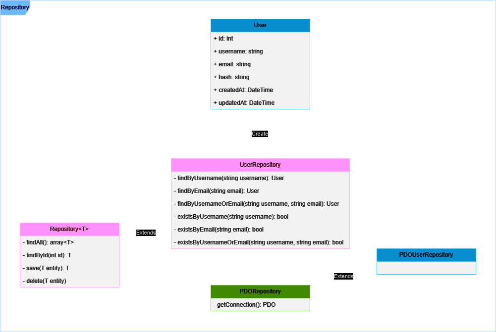

# PHP MVC Dependency Injection

[](https://www.php.net/)
[](https://httpd.apache.org/)
[](https://mariadb.org/)
[](https://getcomposer.org/)
[](https://git-scm.com/)
[](https://github.com/)

This project is a basic web application template in PHP following the [Model-View-Controller (MVC) design pattern](https://en.wikipedia.org/wiki/Model%E2%80%93view%E2%80%93controller) and extensively applying the [Dependency Injection Pattern](https://en.wikipedia.org/wiki/Dependency_injection).

The MVC design pattern combined with dependency injection is an excellent combination in PHP projects. The Model-View-Controller pattern separates responsibilities between business logic (Model), user interface (View), and application flow control (Controller). Dependency injection helps avoid spaghetti code, improving code scalability and maintenance. Additionally, this project includes a service layer to handle business logic, similar to how projects are structured in [Spring](https://spring.io/).

## Features

- **User Authentication:** User login, registration, and logout.
- **User Profile:** View details of the logged-in user.

## Characteristics

- **Basic Template:** This project serves as a template with basic functionality for a web page.
- **PDO Implementation:** By default, the project includes an implementation to access the database using PDO (PHP Data Objects).
- **CSRF Protection:** Built-in protection against Cross-Site Request Forgery (CSRF) attacks.

## Project Structure

- **`.env.example`**: Example configuration file for environment variables (.env).
- **`.gitignore`**: Configuration file to ignore files in Git.
- **`.htaccess`**: Configuration file for URL rewriting in Apache.
- **`composer.json`**: Composer file with dependencies and autoloads.
- **`index.php`**: Main entry point of the application.
- **`src/`**: Contains the application logic.
  - **`Controllers/`**: Application controllers.
  - **`DependencyContainer.php`**: Contains the dependency container.
  - **`Dtos/`**: Data Transfer Objects.
  - **`Helpers/`**: Helper functions.
  - **`Models/`**: Data models.
  - **`Repositories/`**: Repositories to interact with the database.
  - **`RouteHandler.php`**: Handles the application routing.
  - **`Services/`**: Application services.
- **`views/`**: Application views.

## UML Diagram (Repository)



## Requirements

- PHP Version >= 8.1
- Composer Version >= 2.5.5
- MySQL/MariaDB

## Installation


1. Install the dependencies:
   ```bash
   composer install
   ```
2. Configure the environment variables in the `.env` file:
   ```bash
   PDO_DB_DSN=
   PDO_DB_USER=
   PDO_DB_PASSWORD=
   ```
3. Set up the database:
   Execute the [SQL Script](./resources/php-mvc.sql) to create the necessary tables.

## Usage

1. Start the local PHP server:
   ```bash
   php -S localhost:8000
   ```
2. ccess the application at `http://localhost:8000`

## Contributions

Contributions are welcome. If you want to contribute, follow these steps:

1. Fork the project.
2. Create a new branch (name it descriptively e.g., `feature/new-feature`).
3. Make changes and commit them.
4. Submit a pull request.

## Resources

- [SQL Script](./resources/php-mvc-repository.png)
- [UML Diagram (Repository)](./resources/php-mvc-repository.png)
